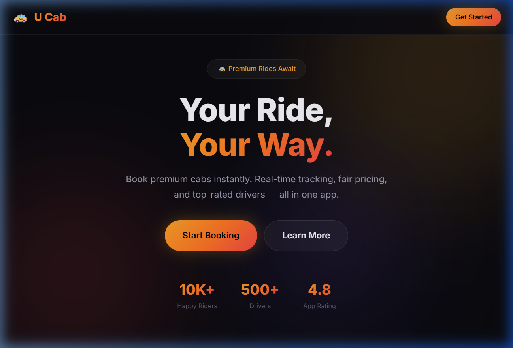
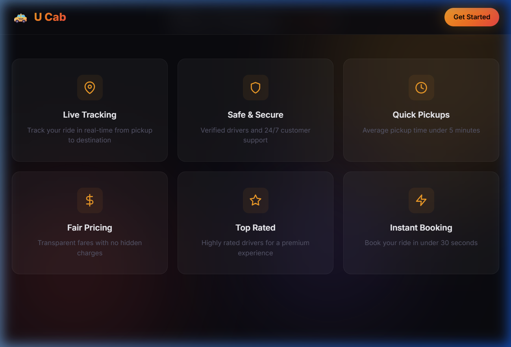
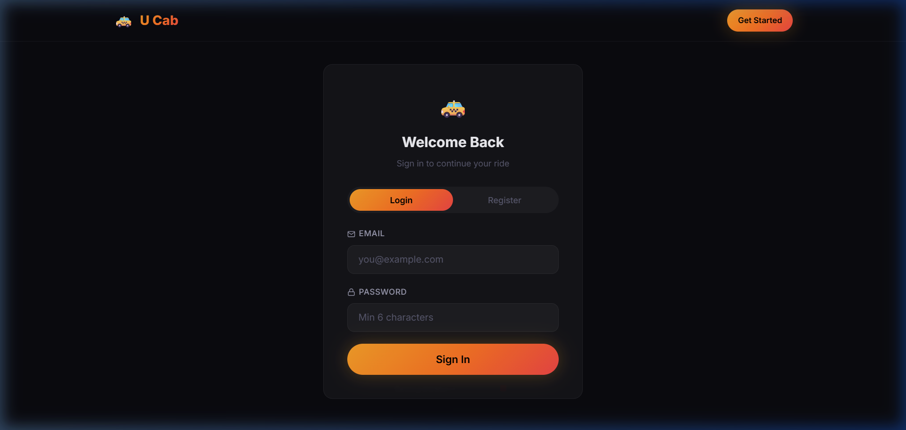
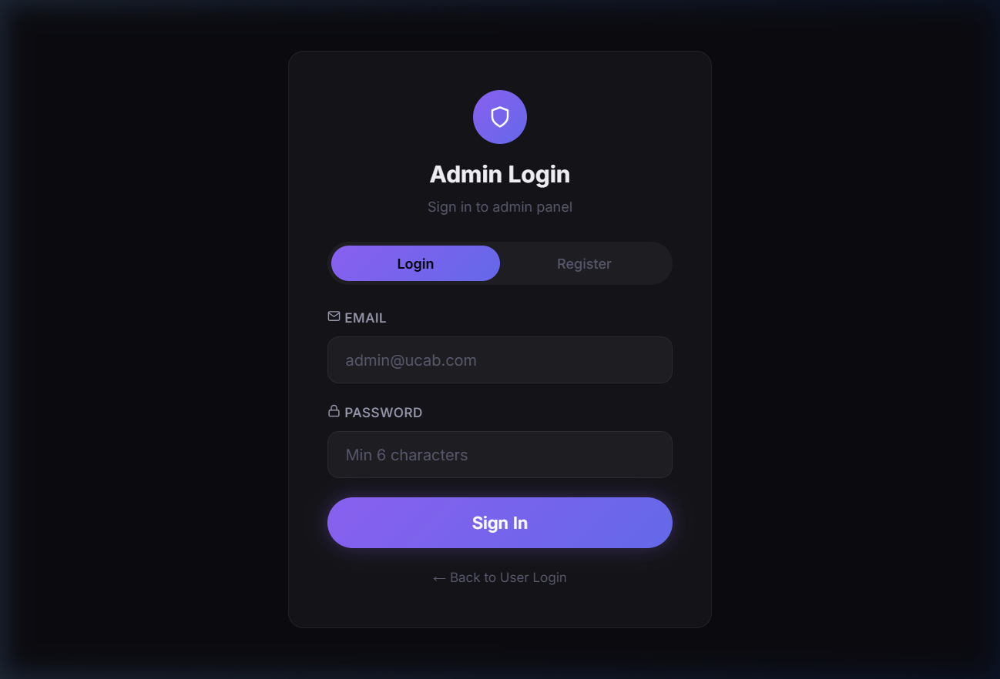

# 🚕 U Cab – MERN Stack Cab Booking Application

A full-featured cab booking platform built with **MongoDB, Express.js, React.js, and Node.js (MERN Stack)**. Users can register, book rides, track drivers in real-time, manage payments, and view ride history. Includes a complete **Admin Panel** for managing users, drivers, bookings, and vehicles.

---

## 📸 Screenshots

### Landing Page


### Features Section


### User Login / Register


### Admin Login Panel


---

## 🏗️ Architecture

The application follows a **4-Layer Architecture**:

```
Client Layer (React.js)  →  API Layer (Express.js)  →  Service Layer (Business Logic)  →  Data Access Layer (Mongoose/MongoDB)
```

### MVC Pattern
- **Model** – Mongoose schemas (`User`, `Driver`, `Ride`, `Transaction`, `Vehicle`, `Admin`)
- **View** – React.js frontend (7 user pages + 9 admin pages)
- **Controller** – Express routes + Service layer for business logic

---

## 📁 Project Structure

```
U Cab/
├── backend/                    # Express.js API Server
│   ├── config/
│   │   └── db.js               # MongoDB connection
│   ├── models/                 # Mongoose schemas
│   │   ├── User.js
│   │   ├── Driver.js
│   │   ├── Ride.js
│   │   ├── Transaction.js
│   │   ├── Vehicle.js
│   │   └── Admin.js
│   ├── services/               # Business logic layer
│   │   ├── fareService.js      # Fare calculation (Haversine)
│   │   ├── rideMatchingService.js  # Geospatial driver matching
│   │   └── trackingService.js  # Ride status lifecycle
│   ├── routes/                 # REST API endpoints
│   │   ├── auth.js             # User authentication
│   │   ├── rides.js            # Ride booking & tracking
│   │   ├── users.js            # User profile & payments
│   │   ├── drivers.js          # Driver management
│   │   └── admin.js            # Admin panel API
│   ├── middleware/
│   │   ├── auth.js             # JWT verification
│   │   └── errorHandler.js     # Error handling
│   ├── server.js               # App entry point
│   ├── seed.js                 # Mock driver data
│   └── .env                    # Environment variables
│
├── frontend/                   # React.js Client
│   ├── src/
│   │   ├── components/         # Reusable UI components
│   │   │   ├── Navbar.jsx
│   │   │   ├── CabCard.jsx
│   │   │   ├── NearbyCab.jsx
│   │   │   ├── BookingModal.jsx
│   │   │   ├── DriverCard.jsx
│   │   │   ├── RideTimer.jsx
│   │   │   └── PaymentCard.jsx
│   │   ├── pages/              # User pages
│   │   │   ├── LandingPage.jsx     # Home
│   │   │   ├── AuthPage.jsx        # Login / Register
│   │   │   ├── Dashboard.jsx       # Uhome (Book a ride)
│   │   │   ├── TrackingPage.jsx    # Real-time tracking
│   │   │   ├── PaymentPage.jsx     # Payment methods
│   │   │   ├── HistoryPage.jsx     # My Bookings
│   │   │   ├── DiscountsPage.jsx   # Offers & coupons
│   │   │   └── admin/             # Admin pages
│   │   │       ├── Alogin.jsx
│   │   │       ├── Ahome.jsx
│   │   │       ├── Anav.jsx
│   │   │       ├── Users.jsx
│   │   │       ├── UserEdit.jsx
│   │   │       ├── Bookings.jsx
│   │   │       ├── Acabs.jsx
│   │   │       ├── Acabedit.jsx
│   │   │       └── Addcar.jsx
│   │   ├── context/            # State management
│   │   │   ├── AuthContext.jsx
│   │   │   ├── BookingContext.jsx
│   │   │   └── AdminContext.jsx
│   │   ├── services/
│   │   │   └── api.js          # Axios API layer
│   │   ├── App.jsx
│   │   └── main.jsx
│   ├── index.html
│   └── vite.config.js
│
├── screenshots/                # App screenshots
└── README.md
```

---

## ✨ Features

### 👤 User (Rider)
- ✅ Register / Login with JWT authentication
- ✅ Book a cab (Economy, Premium, XL)
- ✅ Search nearby drivers (geospatial queries)
- ✅ Fare estimation with distance calculation
- ✅ Real-time ride tracking with ETA countdown
- ✅ Manage saved payment methods
- ✅ View ride history with status badges
- ✅ Apply discount/coupon codes

### 🛡️ Admin
- ✅ Separate admin login/register
- ✅ Dashboard with analytics (users, rides, revenue)
- ✅ Manage users (view, edit, delete)
- ✅ Monitor all bookings
- ✅ Manage cabs/vehicles (add, edit, delete)
- ✅ View reports & statistics

---

## 🔗 API Endpoints

### Authentication
| Method | Endpoint | Description |
|--------|----------|-------------|
| POST | `/api/auth/register` | Register user |
| POST | `/api/auth/login` | Login user |
| GET | `/api/auth/me` | Get current user |

### Rides
| Method | Endpoint | Description |
|--------|----------|-------------|
| POST | `/api/rides/book` | Book a new ride |
| GET | `/api/rides/:id` | Get ride details |
| PUT | `/api/rides/:id` | Update ride status |
| DELETE | `/api/rides/:id` | Cancel ride |
| GET | `/api/rides/history/:userId` | Ride history |
| GET | `/api/rides/nearby-drivers` | Find nearby drivers |
| POST | `/api/rides/fare-estimate` | Get fare estimate |

### Users
| Method | Endpoint | Description |
|--------|----------|-------------|
| GET | `/api/users/:id` | Get user profile |
| PUT | `/api/users/:id` | Update profile |
| POST | `/api/users/:id/payment` | Save payment method |
| GET | `/api/users/:id/payments` | Get saved payments |

### Admin
| Method | Endpoint | Description |
|--------|----------|-------------|
| POST | `/api/admin/register` | Admin register |
| POST | `/api/admin/login` | Admin login |
| GET | `/api/admin/users` | All users |
| PUT | `/api/admin/users/:id` | Edit user |
| DELETE | `/api/admin/users/:id` | Delete user |
| GET | `/api/admin/bookings` | All bookings |
| GET | `/api/admin/cabs` | All vehicles |
| POST | `/api/admin/cabs` | Add vehicle |
| PUT | `/api/admin/cabs/:id` | Edit vehicle |
| DELETE | `/api/admin/cabs/:id` | Delete vehicle |
| GET | `/api/admin/stats` | Dashboard analytics |

---

## 🔒 Security

- **JWT Authentication** – Token-based auth for users and admins
- **Bcrypt** – Password hashing with salt rounds
- **Role-Based Access** – Separate middleware for user and admin routes
- **Protected Routes** – Frontend route guards for authenticated pages

---

## 🛠️ Tech Stack

| Layer | Technology |
|-------|-----------|
| Frontend | React.js, Vite, Framer Motion, Axios |
| Backend | Node.js, Express.js |
| Database | MongoDB, Mongoose ODM |
| Auth | JWT, bcryptjs |
| Styling | Vanilla CSS (Dark Theme, Glassmorphism) |

---

## 🚀 Getting Started

### Prerequisites
- Node.js (v16+)
- MongoDB (local or Atlas)
- npm

### Installation

```bash
# Clone the repository
git clone <repo-url>
cd "U Cab"

# Install backend dependencies
cd backend
npm install

# Install frontend dependencies
cd ../frontend
npm install
```

### Configuration

Create `backend/.env`:
```
MONGO_URI=mongodb://localhost:27017/ucab
JWT_SECRET=your_secret_key
PORT=5000
```

### Run the Application

```bash
# Terminal 1 – Start MongoDB (if local)
mongod

# Terminal 2 – Seed drivers & start backend
cd backend
node seed.js        # Seeds 12 mock drivers (run once)
node server.js      # API on http://localhost:5000

# Terminal 3 – Start frontend
cd frontend
npm run dev         # App on http://localhost:3000
```

### Access
- **User App**: http://localhost:3000
- **Admin Panel**: http://localhost:3000/admin/login

---

## 📊 Database Collections

| Collection | Description |
|-----------|-------------|
| `users` | Registered riders with saved payments |
| `drivers` | Drivers with GeoJSON locations |
| `rides` | Booking records with status lifecycle |
| `transactions` | Payment records linked to rides |
| `vehicles` | Admin-managed vehicle fleet |
| `admins` | Admin accounts |

---

## 👨‍💻 Author

**U Cab** – A MERN Stack Cab Booking Application

---

## 📝 License

This project is for educational purposes.
